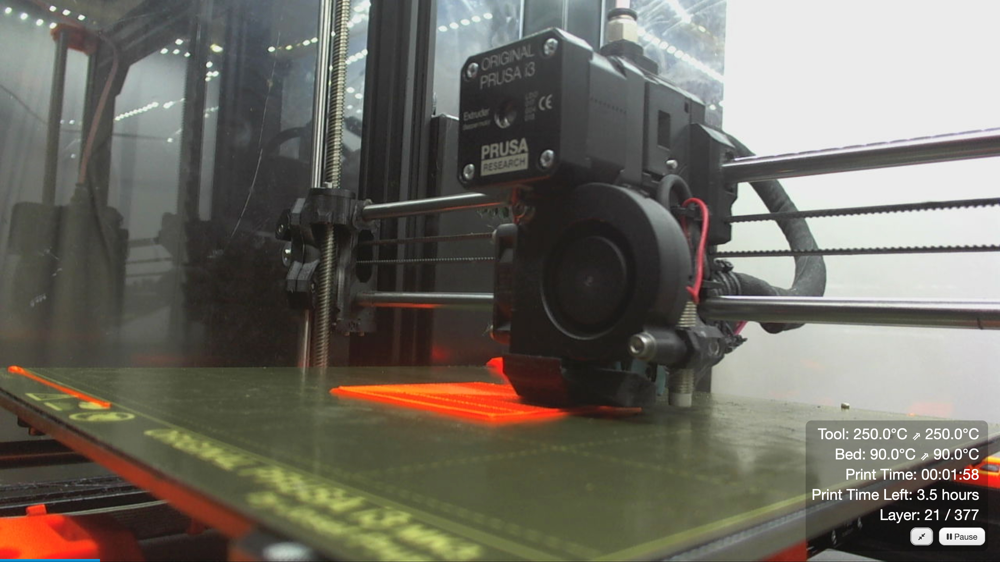

# OctoPrint-Fullscreen

> **Note**
> This plugin is a continuation of the impressive work by Paul de Vries.
>
> It is now actively maintained here to ensure compatibility with modern OctoPrint versions.

This plugin will allow you to open the webcam feed in fullscreen mode by double clicking the image. It will show a progress bar at the bottom of the feed and an overlay containing information about print time, remaining time, temperatures and a pause button.

If the DisplayLayerProgress plugin is installed, it will also display the layer progress.

## Screenshot

## Setup

Install via the bundled [Plugin Manager](https://github.com/foosel/OctoPrint/wiki/Plugin:-Plugin-Manager)
or manually using this URL:

    https://github.com/MikeRatcliffe/OctoPrint-FullScreen/archive/main.zip

## Support browsers (tested)

- IE Edge
- Firefox
- Chrome
